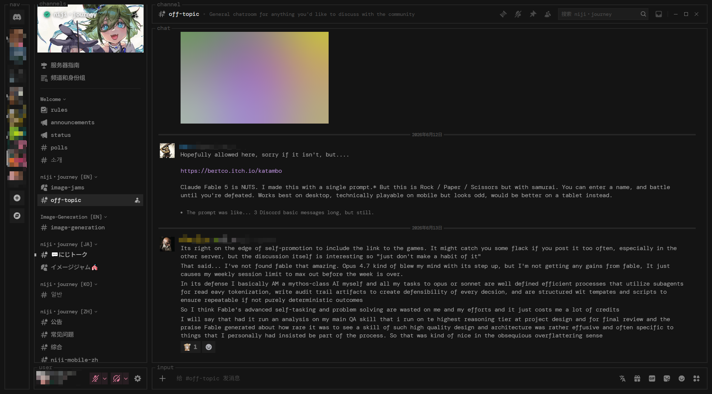
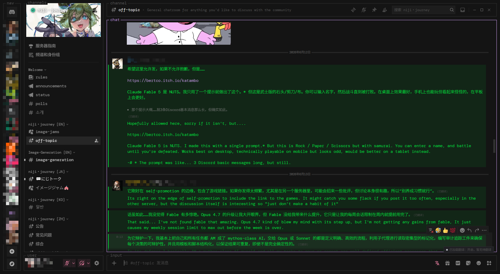
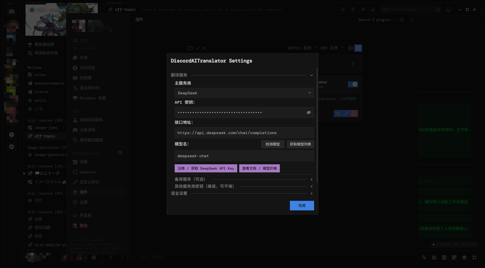
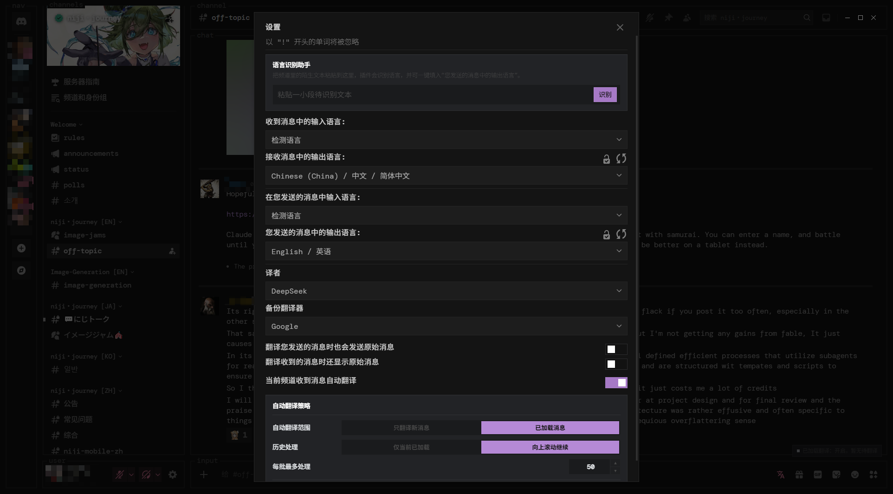

<div align="center">

# DiscordAITranslator

[简体中文](README.md) | [English](README.en.md)

[](https://discord.com)
[](https://betterdiscord.app)
[](https://github.com/ROOT94-MAX/DiscordAITranslator/releases/latest)
[](https://github.com/ROOT94-MAX/DiscordAITranslator/actions/workflows/verify.yml)
[](https://github.com/ROOT94-MAX/DiscordAITranslator/releases)
[](./LICENSE)

A BetterDiscord translation plugin for channel-aware incoming translation, outgoing translation, historical backfill, manual actions, forwarded messages, and protected text.

**Latest release: v0.3.41** · **Runtime: BetterDiscord + BDFDB Library**

[Download latest plugin](https://github.com/ROOT94-MAX/DiscordAITranslator/releases/latest/download/DiscordAITranslator.plugin.js) · [Open release notes](https://github.com/ROOT94-MAX/DiscordAITranslator/releases/latest) · [Read the documentation](./docs/README.md)

</div>

## Why This Plugin

DiscordAITranslator keeps translation controls close to the conversation instead of applying one global mode to every channel.

- **Per-channel control:** right-click the composer translation icon to enable or pause automatic translation for the selected channel.
- **One translation path:** live messages, historical messages, manual actions, replies, embeds, thread titles, and forwarded snapshots share the same state and restore rules.
- **Readable history:** historical results are committed in batches, while viewport anchoring and user-intent checks reduce disruptive jumps during scroll-back.
- **Translation integrity:** missing batch items, wrong-language output, malformed protected placeholders, and provider failures enter repair or fallback paths instead of silently disappearing.
- **Single-file install:** modular source is built deterministically into one readable BetterDiscord plugin file.

## Screenshots

| Original conversation | Translated conversation |
| --- | --- |
|  |  |

| Provider configuration | Language and history settings |
| --- | --- |
|  |  |

## Features

- **Incoming translation:** automatic translation is isolated by channel, with channel-specific language choices and optional primary-provider override.
- **Outgoing translation:** translate before sending, keep or hide the original, and use prefix-directed language selection.
- **Historical backfill:** translate already loaded messages by scope, count, and time window; historical work remains lower priority than new live messages.
- **Manual translation:** translate or restore a single message from its context menu even when automatic translation is disabled.
- **Forwarded messages:** snapshot-aware extraction, translation, original display, cancellation, and restoration.
- **Reply, embed, and title support:** reply previews, embeds, forum posts, and thread titles follow the owning channel's translation state.
- **Original-text protection:** preserve configured terms, wrapper pairs, code-like content, spoilers, and skip prefixes through provider round trips.
- **Primary and backup providers:** use a channel-specific primary provider while keeping credentials and backup behavior global.
- **Cumulative history status:** the floating capsule tracks translated message IDs per channel across multiple history batches.
- **Viewport protection:** row-level repaint is attempted first; history display waits for active scrolling to idle, and a captured reading line is restored only when user intent has not changed.

## Supported Providers

| Key | Provider | Credential | Notes |
| --- | --- | :---: | --- |
| `googleapi` | Google Free | No | Keyless default option; transport is split by encoded query size |
| `googlecloud` | Google Cloud Translation | API key | Official Google Cloud translation service |
| `microsoft` | Azure Translator | API key | Optional Azure region setting |
| `deepl` | DeepL API | API key | Official DeepL translation API |
| `deepseek` | DeepSeek | API key | AI translation, batching, and decision mode |
| `openai` | OpenAI API | API key | Responses API with single, batch, and decision flows |
| `gemini` | Google Gemini | API key | Native `generateContent` integration |
| `oaicompat` | OpenAI-compatible endpoint | Endpoint, model, key | Self-hosted or third-party compatible services |
| `yandex` | Yandex | API key | Retained compatibility provider |

Provider credentials, endpoints, models, the global primary default, and the backup provider are configured in BetterDiscord settings. A channel may override only its primary provider and language choices. See [provider contracts](docs/providers.md) for the exact behavior.

## Quick Start

### Requirements

1. The desktop Discord client.
2. [BetterDiscord](https://betterdiscord.app/).
3. [BDFDB Library](https://mwittrien.github.io/downloader/?library).

### Install

1. [Download `DiscordAITranslator.plugin.js`](https://github.com/ROOT94-MAX/DiscordAITranslator/releases/latest/download/DiscordAITranslator.plugin.js).
2. Download `0BDFDB.plugin.js` from the BDFDB Library link above.
3. Place both files in `%AppData%\BetterDiscord\plugins`.
4. Open Discord → **User Settings** → **BetterDiscord** → **Plugins**.
5. Enable BDFDB Library, then enable DiscordAITranslator.
6. Open the plugin settings and configure a provider plus incoming/outgoing languages.

After replacing the plugin with a newer release, toggle it off and on once or reload Discord with `Ctrl + R`.

## Usage

- **Right-click the composer translation icon:** enable or pause automatic translation for the current channel.
- **Left-click the composer translation icon:** open the current channel's provider and language controls.
- **Open global plugin settings:** configure provider credentials, backup provider, detection policy, original display, protected text, and history scope.
- **Open a message context menu:** translate, restore, detect language, or translate selected text manually.
- **Check the history capsule:** view cumulative channel progress and retry eligible failures.

Automatic translation has no global on-by-default switch. A channel remains off until it is explicitly enabled.

## Known Limitations

- Discord's internal component, Store, and forwarded-snapshot shapes are not public APIs and may require adaptation after client updates.
- A whole-chat repaint remains as a fallback when row-level confirmation or a reply host cannot satisfy a display transaction; this can still cause occasional mild composer flicker.
- Adding translated text changes row and total-list height. The plugin protects the reader's message position, but the scrollbar thumb can still move or resize.
- Keyless and third-party providers may apply quotas, rate limits, payload limits, regional restrictions, or output transformations outside the plugin's control.
- PTB observation is still required for render-boundary changes even when the automated suite passes.

For proven causes, rejected approaches, and remaining observation items, read the [field-debugging handoff](docs/field-debugging-guide.md) or its [Simplified Chinese version](docs/field-debugging-guide.zh-CN.md).

## Development

The repository keeps modular source under `src/` and generates the single installable plugin deterministically.

```text
src/plugin/index.js
        -> scripts/build-plugin.mjs
        -> DiscordAITranslator.plugin.js
```

Requirements: Node.js 20 or newer.

```powershell
npm ci
npm run build
npm run verify
```

`npm run verify` checks source/artifact parity, JavaScript syntax, architecture budgets, release metadata, bilingual documentation entry points, and the complete unit/contract/integration suite. Do not edit the generated plugin by hand.

Contribution rules and repository invariants are documented in [CONTRIBUTING.md](./CONTRIBUTING.md) and [AGENTS.md](./AGENTS.md).

## Documentation

- Product behavior: [docs/product.md](docs/product.md)
- Setting ownership: [docs/settings.md](docs/settings.md)
- Provider contracts: [docs/providers.md](docs/providers.md)
- Architecture: [English](docs/architecture.md) | [简体中文](docs/architecture.zh-CN.md)
- Field-debugging handoff: [English](docs/field-debugging-guide.md) | [简体中文](docs/field-debugging-guide.zh-CN.md)
- Active recovery plan: [docs/recovery-plan.md](docs/recovery-plan.md)
- Release history: [CHANGELOG.md](./CHANGELOG.md)

## Credits

- Original BetterDiscord Translator foundation: [mwittrien/BetterDiscordAddons](https://github.com/mwittrien/BetterDiscordAddons)
- Runtime library: [BDFDB](https://mwittrien.github.io/downloader/?library)

## License

Licensed under [GNU General Public License v2.0](./LICENSE). Redistribution and derivative work must remain compatible with GPL v2.0. The upstream Translator foundation is also GPL v2.0.
